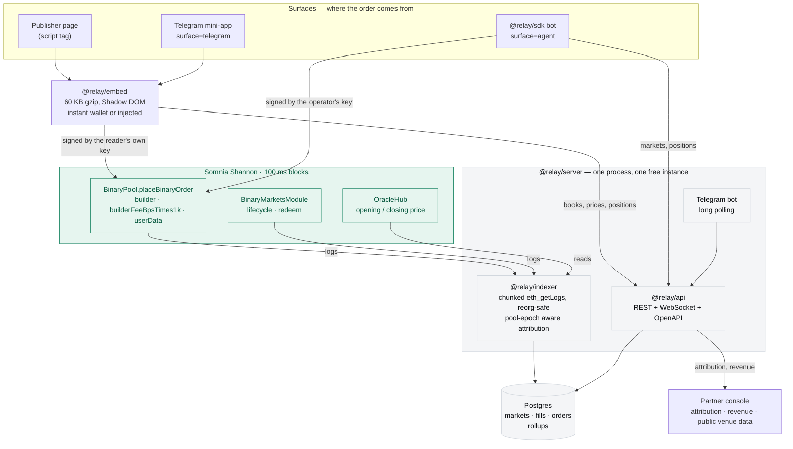

# Relay

**Prediction markets, distributed. Two lines of HTML put a live DreamDEX market inside
anyone's page, and the publisher who sent the order is credited on chain, inside the
order itself.**

[](https://github.com/SohamJuneja/relay/actions/workflows/ci.yml)
[](#run-it-locally)
[](packages/embed/README.md)
[](https://shannon-explorer.somnia.network)
[](LICENSE)

The DreamDEX venue runs prediction markets in rolling 5-minute, 15-minute, 1-hour,
4-hour and 1-day windows: will BTC be above where this window opened when it closes?
They are live, continuously priced by market makers, and a tenth of
them expire with liquidity quoted on both sides and nobody taking it. That is not a
liquidity problem; it is a distribution problem. Relay is two
lines of markup that put a working market card inside somebody else's page, a Telegram
mini-app that does the same inside a chat, an SDK that lets a trading bot do it from
Node, and an indexer that reads Somnia's logs directly so the publisher who sent an
order can be credited for it — on chain, in the order itself, not in our database.

```html
<script src="https://relay-cdn-sohamjunejas-projects.vercel.app/relay.iife.js"></script>
<div data-relay-market data-partner="3" data-builder="0xYourBuilderAddress"></div>
```

That is the whole integration. The card renders into its own Shadow DOM, so the host
page's CSS cannot reach in and the widget's cannot leak out.

---

## Sixty seconds, if that is all you have

1. **[Open the console](https://relay-console-sohamjunejas-projects.vercel.app)** — the
   widget on the right is real and trading against the live venue.
2. **[Try your own snippet](https://relay-console-sohamjunejas-projects.vercel.app/try)**
   — put any partner id and address in, watch the card mount with them.
3. **[Read an article with a market in it](https://relay-demo-sohamjunejas-projects.vercel.app/btc-window/)**
   — the market card is in the article. *Create a wallet in this browser*, take the
   faucet, pick a side. No extension, no bridging, no leaving the page.
4. **[Watch your trade land](https://relay-console-sohamjunejas-projects.vercel.app/ecosystem)**
   — the fill appears on the public leaderboard, credited to that publisher, within
   seconds.

Nothing above needs an account, a wallet, or a signature from you.

## Live

| | |
| --- | --- |
| Partner console | <https://relay-console-sohamjunejas-projects.vercel.app> |
| Try your snippet | <https://relay-console-sohamjunejas-projects.vercel.app/try> |
| Public venue data | <https://relay-console-sohamjunejas-projects.vercel.app/ecosystem> |
| Block Ledger (demo publication) | <https://relay-demo-sohamjunejas-projects.vercel.app> |
| Telegram mini-app | <https://relay-miniapp-sohamjunejas-projects.vercel.app> |
| API + OpenAPI | <https://relay-server-htey.onrender.com/health> · [docs](https://relay-server-htey.onrender.com/docs) · [openapi.json](https://relay-server-htey.onrender.com/docs/json) |
| Widget bundle (CDN) | <https://relay-cdn-sohamjunejas-projects.vercel.app/relay.iife.js> |
| Telegram bot | [@RelaySomniaBot](https://t.me/RelaySomniaBot) |

## The number this is built around

From `GET /v1/stats/overview` on the DreamDEX venue, **11 September 2026, 16:56 UTC**:

| | |
| --- | --- |
| Windows that expired with **no trade at all** | **12.2%** |
| …of those, the share that had liquidity **quoted on both sides and refused** | **100% of them (12.2% of all windows)** |
| 24-hour notional on the venue | **$205,332** tUSDC across 31,026 fills |

A tenth of this venue's markets are tradeable and go untraded. Every number above is
derived from Somnia logs by Relay's own indexer, which does not depend on DreamDEX's.

That second row is the whole thesis. These are not illiquid markets nobody could trade.
Market makers quoted **both sides**, the whole window, and nobody showed up. The
product is fine. The audience is somewhere else — inside articles, group chats and
bots — which is exactly where Relay puts it.

> These figures are rewritten by [`scripts/readme-numbers.mjs`](scripts/readme-numbers.mjs)
> from the live API, together with the timestamp that produced them. It refuses to run
> while the indexer is behind, because a "24-hour" figure taken from a cursor that has
> not reached the last 24 hours is a different question being answered.

## How the credit actually works

Most affiliate systems are a database row: trust us, we counted. Relay's is a 64-bit
integer inside the order the reader signs, plus the partner's address on the fee
channel. Anyone can read it off Somnia without asking us anything.

```
userData (uint64)
┌────────┬─────────────────────────┬─────────────┬──────────┐
│version │        partnerId        │  surfaceId  │ reserved │
│ 8 bits │         32 bits         │   16 bits   │  8 bits  │
└────────┴─────────────────────────┴─────────────┴──────────┘
         BinaryPool.placeBinaryOrder(..., builder, builderFeeBpsTimes1k, userData)
                                          └── the partner's payout address
```

Two channels, deliberately. `userData` says **who sent this and from where** and costs
nothing. `builder` is the address the fee is paid to on mainnet, where the pool cap is
1%. On this testnet the cap is `0`, so a tagged order costs the reader nothing — the
plumbing is identical either way, which is the point.

`decodeUserData()` never throws on somebody else's tag; it returns `tagged: false`. See
[`docs/ATTRIBUTION.md`](docs/ATTRIBUTION.md) for the layout and why there are two
channels rather than one.

## Surfaces

One partner, several places their readers are. All roll up to a single id rather than
three accounts to reconcile.

| Surface | Id | What sends it | Who signs |
| --- | --- | --- | --- |
| `web` | 1 | The widget on a publisher's page | An instant wallet in the browser, or the reader's own |
| `telegram` | 2 | The mini-app inside a chat | Instant wallet in the WebView |
| `api` | 6 | Anything calling the contracts with a Relay tag | The caller's |
| `agent` | 7 | A bot built on [`@relay/sdk`](packages/sdk) | The operator's own key |

`farcaster` (3), `discord` (4) and `mobile` (5) are reserved in
[`SURFACE`](packages/core/src/attribution.ts) but not yet shipped.

The console's dashboard splits revenue by surface, so a publisher who also runs a bot
sees both rows under one identity.

## Architecture



`@relay/core` sits under all of it: pinned ABIs, addresses, the integer encoding, and
the order maths — one `buildTakerOrder` shared by the browser widget and the Node
signer, so a preview and a signed order can never disagree.

**The indexer reads the chain, not DreamDEX.** Every number on every page comes from
`eth_getLogs` against Somnia, chunked to the 1000-block cap, reorg-safe via parent-hash
anchoring, and aware that a pool is recycled onto its next market — so a fill is
attributed to the order that produced it even when that order was placed in an earlier
epoch of the same pool. If DreamDEX's API disappeared tomorrow, none of this would
notice.

## Proof it works end to end

Every hash below is a real transaction on Shannon, produced by a verification run, not
by hand. Explorer:
[shannon-explorer.somnia.network](https://shannon-explorer.somnia.network)

| Phase | What it proves | Transaction |
| --- | --- | --- |
| 1 | A signed IOC order that fills, tagged with a builder code and a `userData` partner tag | [`0x743321c2…e7e648`](https://shannon-explorer.somnia.network/tx/0x743321c27567123b860e590b64a3bbcf4eba1713994532de37fade90c5e7e648) |
| 1 | `approveBuilder`, settling the question of whether a builder address is accepted at a zero fee cap | [`0x4eb1d57d…671d30`](https://shannon-explorer.somnia.network/tx/0x4eb1d57d06d409f709d0f4f1b2c698724d0124d8a6937d26b0d64902ac671d30) |
| 1 | Redeeming a winning position after settlement | [`0xbb822561…840ed`](https://shannon-explorer.somnia.network/tx/0xbb822561d08415778505f1a6d58038fd643006453d3895a12a2e9dada20840ed) |
| 2 | A fill reaching the public API 6.9 s after mining over REST, 7.7 s over the socket | [`0x29531227…980f8`](https://shannon-explorer.somnia.network/tx/0x29531227875fa906f845b0903930441623a6473a632a3f8e37cd5f85977980f8) |
| 3.5 | A $1 trade from the widget, won and claimed | [`0xca57c40b…e2e70`](https://shannon-explorer.somnia.network/tx/0xca57c40b721a7be53d71cdb241790a0ad7954273bc108e107fd41f542b4e2e70) → [`0xd50090c9…455ff`](https://shannon-explorer.somnia.network/tx/0xd50090c91e4e7d0a97d04dbd3690ecabe760533a09d72372ac63dc96acf455ff) |
| 4 | A partner registered in the console, trading from its own preview, credited on its dashboard 4.6 s later | [`0x42aa45bd…292f0`](https://shannon-explorer.somnia.network/tx/0x42aa45bdce868d849bcd219994becaced525688fb9ef9fd0732d1b09f7e292f0) |
| 5 | A trade from a third party's article, attributed to that publisher | [`0xed3b724f…b1dce`](https://shannon-explorer.somnia.network/tx/0xed3b724ff97bd7f56471cf18740b1a23e6fc36eedcb56ff34bae85b6068b1dce) |
| 5 | A trade from the Telegram mini-app, attributed with `surface=telegram` | [`0xa394e98d…30a7`](https://shannon-explorer.somnia.network/tx/0xa394e98d2e1d07306e0f6f332acbe6ff98417f1d5f005df973e9bbf76e0e30a7) |
| 6 | A $1 trade taken on the **deployed** stack — public article, public API, public console — filled and indexed in 22.9 s as `partner 3 · surface 1 (web)` | [`0x9f207809…a7505`](https://shannon-explorer.somnia.network/tx/0x9f207809491cfdce117913ed1be9968b733ae9674a2e378b840059553e5a7505) |
| 7 | An agent on `@relay/sdk` buying its own side, tagged `surface=7 (agent)`, then redeeming what it won | [`0xeac8b0c0…f0482`](https://shannon-explorer.somnia.network/tx/0xeac8b0c01510d5e026a0c3e70f04ab78e6d755f7c052f0fea6caec85139f0482) → [`0x98800857…71f515`](https://shannon-explorer.somnia.network/tx/0x98800857130402febac1bef3abd5d2106de32d4dfc0f299297c1f165d271f515) |
| 7 | A won position redeemed **with no interaction at all** — the instant wallet claims for itself | [`0x2dbb2d94…94c0d`](https://shannon-explorer.somnia.network/tx/0x2dbb2d94210a44e2ae45b698e3bbd66787ecde198bd062c2b4558ce00e494c0d) → [`0x1cd4d496…9ce55`](https://shannon-explorer.somnia.network/tx/0x1cd4d496bd22332ac99bfe9cce4d7e03b06b5bc473da55ea7add60a10459ce55) |

## The parts that were actually hard

A distribution layer is only worth anything if the attribution survives contact with a
real chain and a real deployment. Most of the work was there, and the findings are
written up rather than summarised:

- **The builder-fee channel was undocumented.** Whether a builder address is even
  accepted at a zero fee cap took a five-case experiment matrix to settle, with a
  transaction for each.
  [`docs/BUILDER_FINDINGS.md`](docs/BUILDER_FINDINGS.md)
- **Pool epochs break naive attribution.** Pools are recycled onto their next market,
  so `(pool, orderId)` is not unique over time. The indexer is epoch-aware.
- **"Quoted but untaken" cannot be counted from order rows.** Orders age out under
  retention, so by the time a window is judged its quotes may be gone. The statistic is
  latched onto two booleans per market at ingest instead — the alternative is keeping
  every order row forever to answer one question about each market.
- **A widget that loads forever looks like a broken widget.** The card used to claim
  "no live window" for the ~1.5 s before its first response landed, on every page load,
  which is a statement about the venue it had not yet asked about.
- **Bundlers break libraries that check types by class name.** node-fetch decides what
  an `AbortSignal` is via `constructor.name`; esbuild renames on collision; the bot
  therefore never sent a single request. Diagnosed from `/health`, not from logs.

There is also a page of feedback for the protocol teams — thirteen things that cost
real time, each with a reproduction: [`docs/SDK_FEEDBACK.md`](docs/SDK_FEEDBACK.md).

## What is not done

Stated plainly, because a demo that hides its edges is worth less than one that does
not:

- **Names are not owned.** Registration proves control of the *builder address* by
  signature; nothing stops someone registering under a name that is not theirs. A
  namespace check is needed before mainnet.
- **The builder fee has never carried a real value.** This testnet's cap is `0`, so
  `BuilderFeeCharged` has always been zero. Its behaviour at a 1% cap, and whether an
  `approveBuilder` survives a pool recycle, cannot be answered here.
- **Rate limiting is per-IP**, which is wrong for real traffic and should key on the
  API key.

All of it, with the file that has to change in each case, is in
[`docs/PATH_TO_MAINNET.md`](docs/PATH_TO_MAINNET.md).

## Run it locally

```bash
pnpm install
docker compose up -d postgres
cp .env.example .env                       # RPC_URL is enough to read; PRIVATE_KEY to trade
pnpm db:migrate && pnpm indexer:backfill   # 24 h of logs, a few minutes
pnpm api:dev                               # :8787 — /docs for the OpenAPI page
```

Then `pnpm console:dev` (:5179), `pnpm demo:dev` (:5180), `pnpm embed:dev` (:5178) or
`pnpm tg:miniapp` (:5181). `pnpm typecheck && pnpm -r test` runs 199 tests.

`pnpm smoke:prod` is the one worth knowing about: it clones the repo into a temp
directory, installs frozen, builds, and starts the server from three different working
directories — because the two worst deploy failures in this project were both paths
that resolved correctly from one cwd and pointed at nothing from another.

## What is in here

| Package | |
| --- | --- |
| [`packages/core`](packages/core) | Chain config, pinned ABIs, encoding, order maths. Browser-safe entry for the widget. |
| [`packages/embed`](packages/embed/README.md) | The widget. 60 KB gzip including viem, Shadow DOM, instant wallet, auto-claim. |
| [`packages/sdk`](packages/sdk) | Relay for agents: `createRelay(...).buy(...)` from Node, every order tagged `surface=agent` with the operator's builder code. Ships a 30-line example bot. |
| [`packages/indexer`](packages/indexer) | Chain-only ingest: chunked `eth_getLogs`, reorg-safe, pool-epoch aware attribution, rollups. |
| [`packages/api`](packages/api) | Fastify REST + WebSocket, zod-typed, OpenAPI 3.1 at `/docs`. |
| [`packages/telegram`](packages/telegram/README.md) | Mini-app and bot. |
| [`packages/telegram-proxy`](packages/telegram-proxy) | A Cloudflare Worker forwarding the Bot API, for when a host cannot reach `api.telegram.org`. |
| [`packages/ui-tokens`](packages/ui-tokens) | One palette and type scale, shared by widget and console. |
| [`packages/server`](packages/server) | API + indexer + bot in one process, for one free instance. |
| [`apps/console`](apps/console/README.md) | Partner console and the public venue data page. |
| [`apps/demo-site`](apps/demo-site/README.md) | Block Ledger — a fictional publication with the widget embedded. |

Everything runs on free tiers: one Render instance, one Neon database, four Vercel
static sites, one Cloudflare Worker. Total cost to operate: nothing.

## Documentation

- [`docs/PROTOCOL_NOTES.md`](docs/PROTOCOL_NOTES.md) — everything learned about the
  protocol and the chain, with the measurements behind each constant.
- [`docs/ATTRIBUTION.md`](docs/ATTRIBUTION.md) — the `userData` layout, the surfaces
  table, and why there are two attribution channels.
- [`docs/BUILDER_FINDINGS.md`](docs/BUILDER_FINDINGS.md) — the builder-code experiment
  matrix, with transaction hashes.
- [`docs/SDK_FEEDBACK.md`](docs/SDK_FEEDBACK.md) — feedback for the DreamDEX and Somnia
  teams: thirteen things that cost us time, each with a reproduction.
- [`docs/PATH_TO_MAINNET.md`](docs/PATH_TO_MAINNET.md) — what changes on mainnet:
  18-decimal collateral, a builder fee cap that is no longer zero, sponsorship instead
  of the gas drip, and the three things that cannot be answered on a testnet pool.
- [`docs/ARCHITECTURE.md`](docs/ARCHITECTURE.md) — the phased plan this was built to.

## Licence

MIT. See [LICENSE](LICENSE) and [CONTRIBUTING.md](CONTRIBUTING.md).
