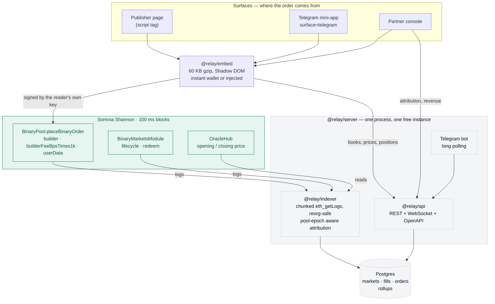

# Relay

**A distribution layer for DreamDEX Event Contracts on Somnia.** DreamDEX opens a
prediction market every minute — "will BTC be above where this window opened when it
closes?" — and a third of them expire with liquidity quoted on both sides and nobody
taking it. That is not a liquidity problem; it is a distribution problem. Relay is two
lines of markup that put a working market card inside somebody else's page, a Telegram
mini-app that does the same inside a chat, and an indexer that reads Somnia's logs
directly so the publisher who sent an order can be credited for it — on chain, in the
order itself, not in our database.

```html
<script src="https://relay-cdn-sohamjunejas-projects.vercel.app/relay.iife.js"></script>
<div data-relay-market data-partner="3" data-builder="0xYourBuilderAddress"></div>
```

## Live

| | |
| --- | --- |
| Partner console | <https://relay-console-sohamjunejas-projects.vercel.app> |
| Public venue data | <https://relay-console-sohamjunejas-projects.vercel.app/ecosystem> |
| Block Ledger (demo publication) | <https://relay-demo-sohamjunejas-projects.vercel.app> |
| Telegram mini-app | <https://relay-miniapp-sohamjunejas-projects.vercel.app> |
| API + OpenAPI | <https://relay-server-htey.onrender.com/health> · [docs](https://relay-server-htey.onrender.com/docs) · [openapi.json](https://relay-server-htey.onrender.com/docs/json) |
| Widget bundle (CDN) | <https://relay-cdn-sohamjunejas-projects.vercel.app/relay.iife.js> |
| Telegram bot | [@RelaySomniaBot](https://t.me/RelaySomniaBot) |

## The number this is built around

From `GET /v1/stats/overview` on the DreamDEX venue, **10 September 2026, 08:28 UTC**:

| | |
| --- | --- |
| Windows that expired with **no trade at all** | **34.4%** |
| …of those, the share that had liquidity **quoted on both sides and refused** | **100% of them (34.4% of all windows)** |
| 24-hour notional on the venue | **$61,473** tUSDC across 17,331 fills |

A third of this venue's markets are tradeable and go untraded. Every number above is
derived from Somnia logs by Relay's own indexer, which does not depend on DreamDEX's.

## Architecture



`@relay/core` sits under all of it: pinned ABIs, addresses, the integer encoding, and
the order maths — one `buildTakerOrder` shared by the browser widget and the Node
signer, so a preview and a signed order can never disagree.

## Proof it works end to end

Every hash below is a real transaction on Shannon, produced by a verification run, not
by hand. Explorer:
[shannon-explorer.somnia.network](https://shannon-explorer.somnia.network)

| Phase | What it proves | Transaction |
| --- | --- | --- |
| 1 | A signed IOC order that fills, tagged with a builder code and a `userData` partner tag | [`0x743321c2…e7e648`](https://shannon-explorer.somnia.network/tx/0x743321c27567123b860e590b64a3bbcf4eba1713994532de37fade90c5e7e648) |
| 1 | `approveBuilder`, settling the question of whether a builder address is accepted at a zero fee cap | [`0x4eb1d57d…671d30`](https://shannon-explorer.somnia.network/tx/0x4eb1d57d06d409f709d0f4f1b2c698724d0124d8a6937d26b0d64902ac671d30) |
| 1 | Redeeming a winning position after settlement | [`0xbb822561…840ed`](https://shannon-explorer.somnia.network/tx/0xbb822561d08415778505f1a6d58038fd643006453d3895a12a2e9dada20840ed) |
| 2 | A fill reaching the public API 6.9 s after mining over REST, 7.7 s over the socket | [`0x29531227…980f8`](https://shannon-explorer.somnia.network/tx/0x29531227875fa906f845b0903930441623a6473a632a3f8e37cd5f85977980f8) |
| 3.5 | A $1 trade from the widget, won and claimed | [`0xca57c40b…e2e70`](https://shannon-explorer.somnia.network/tx/0xca57c40b721a7be53d71cdb241790a0ad7954273bc108e107fd41f542b4e2e70) → [`0xd50090c9…455ff`](https://shannon-explorer.somnia.network/tx/0xd50090c91e4e7d0a97d04dbd3690ecabe760533a09d72372ac63dc96acf455ff) |
| 4 | A partner registered in the console, trading from its own preview, credited on its dashboard 4.6 s later | [`0x42aa45bd…292f0`](https://shannon-explorer.somnia.network/tx/0x42aa45bdce868d849bcd219994becaced525688fb9ef9fd0732d1b09f7e292f0) |
| 5 | A trade from a third party's article, attributed to that publisher | [`0xed3b724f…b1dce`](https://shannon-explorer.somnia.network/tx/0xed3b724ff97bd7f56471cf18740b1a23e6fc36eedcb56ff34bae85b6068b1dce) |
| 5 | A trade from the Telegram mini-app, attributed with `surface=telegram` | [`0xa394e98d…30a7`](https://shannon-explorer.somnia.network/tx/0xa394e98d2e1d07306e0f6f332acbe6ff98417f1d5f005df973e9bbf76e0e30a7) |
| 6 | A $1 trade taken on the **deployed** stack — public article, public API, public console — filled and indexed in 22.9 s as `partner 3 · surface 1 (web)` | [`0x9f207809…a7505`](https://shannon-explorer.somnia.network/tx/0x9f207809491cfdce117913ed1be9968b733ae9674a2e378b840059553e5a7505) |

## Run it locally

```bash
pnpm install
docker compose up -d postgres
cp .env.example .env                       # RPC_URL is enough to read; PRIVATE_KEY to trade
pnpm db:migrate && pnpm indexer:backfill   # 24 h of logs, a few minutes
pnpm api:dev                               # :8787 — /docs for the OpenAPI page
```

Then `pnpm console:dev` (:5179), `pnpm demo:dev` (:5180), `pnpm embed:dev` (:5178) or
`pnpm tg:miniapp` (:5181). `pnpm typecheck && pnpm -r test` runs 142 tests.

## What is in here

| Package | |
| --- | --- |
| [`packages/core`](packages/core) | Chain config, pinned ABIs, encoding, order maths. Browser-safe entry for the widget. |
| [`packages/sdk`](packages/sdk) | Relay for agents: `createRelay(...).buy(...)` from Node, every order tagged `surface=agent` with the operator's builder code. Ships a 30-line example bot. |
| [`packages/indexer`](packages/indexer) | Chain-only ingest: chunked `eth_getLogs`, reorg-safe, pool-epoch aware attribution, rollups. |
| [`packages/api`](packages/api) | Fastify REST + WebSocket, zod-typed, OpenAPI 3.1 at `/docs`. |
| [`packages/embed`](packages/embed/README.md) | The widget. 60 KB gzip including viem, Shadow DOM, instant wallet. |
| [`packages/telegram`](packages/telegram/README.md) | Mini-app and bot. |
| [`packages/ui-tokens`](packages/ui-tokens) | One palette and type scale, shared by widget and console. |
| [`packages/server`](packages/server) | API + indexer + bot in one process, for one free instance. |
| [`apps/console`](apps/console/README.md) | Partner console and the public venue data page. |
| [`apps/demo-site`](apps/demo-site/README.md) | Block Ledger — a fictional publication with the widget embedded. |

## Documentation

- [`docs/PROTOCOL_NOTES.md`](docs/PROTOCOL_NOTES.md) — everything learned about the
  protocol and the chain, with the measurements behind each constant.
- [`docs/ATTRIBUTION.md`](docs/ATTRIBUTION.md) — the `userData` layout and why there
  are two attribution channels.
- [`docs/BUILDER_FINDINGS.md`](docs/BUILDER_FINDINGS.md) — the builder-code experiment
  matrix, with transaction hashes.
- [`docs/SDK_FEEDBACK.md`](docs/SDK_FEEDBACK.md) — feedback for the DreamDEX and Somnia
  teams: thirteen things that cost us time, each with a reproduction.
- [`docs/PATH_TO_MAINNET.md`](docs/PATH_TO_MAINNET.md) — what changes on mainnet:
  18-decimal collateral, a builder fee cap that is no longer zero, sponsorship instead
  of the gas drip, and the three things that cannot be answered on a testnet pool.
- [`docs/ARCHITECTURE.md`](docs/ARCHITECTURE.md) — the phased plan this was built to.

## Licence

MIT. See [LICENSE](LICENSE) and [CONTRIBUTING.md](CONTRIBUTING.md).
